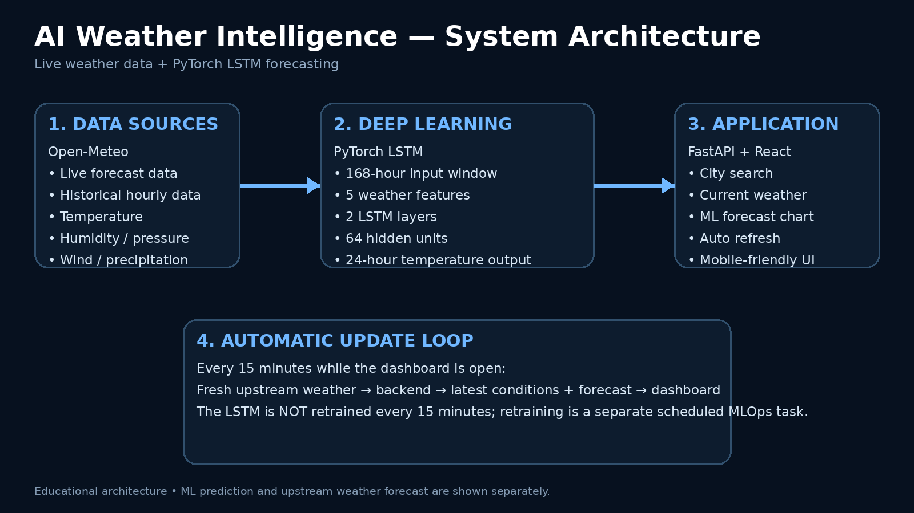

# 🌦️ AI Weather Intelligence & Forecasting

> **A Deep Learning weather forecasting system using PyTorch LSTM + live weather data + FastAPI + React.**



---

## 📌 Project Overview

**AI Weather Intelligence** is a full-stack Deep Learning project that combines:

- 🧠 **PyTorch LSTM neural network**
- 🌦️ **Live weather data**
- 📊 Historical weather data
- ⚡ FastAPI backend
- ⚛️ React frontend
- 📈 Interactive forecasting charts
- 🔄 Automatic live-data refresh
- 🗺️ City search and geocoding

The project is designed to demonstrate how a **Deep Learning time-series model** can be integrated into a real online application.

### What makes this a Deep Learning project?

The core prediction engine is a trained **Long Short-Term Memory (LSTM)** neural network.

The model receives a sequence of historical weather observations:

```text
Temperature
Humidity
Pressure
Wind Speed
Precipitation
       ↓
Latest 168 hours
       ↓
PyTorch LSTM
       ↓
Next 24 hourly temperature values
```

PyTorch's `nn.LSTM` is specifically designed for sequence/time-series modeling and supports multi-layer LSTM networks. [PyTorch LSTM documentation](https://docs.pytorch.org/docs/stable/generated/torch.nn.modules.rnn.LSTM.html)

---

# 🧠 How the Complete System Works

```text
                 USER
                  │
                  ▼
        ┌───────────────────┐
        │   React Website   │
        └─────────┬─────────┘
                  │
                  ▼
        ┌───────────────────┐
        │   FastAPI Server  │
        └───────┬─────┬─────┘
                │     │
       ┌────────┘     └──────────┐
       ▼                         ▼
Open-Meteo Forecast       Trained LSTM Model
       │                         │
       ▼                         ▼
Current / forecast data   ML temperature forecast
       │                         │
       └──────────┬──────────────┘
                  ▼
           Combined Response
                  │
                  ▼
        Interactive Dashboard
```

---

# 1. 🌦️ Weather Data Collection

The project uses **Open-Meteo** as its default weather-data provider.

The application can request:

- Temperature
- Relative humidity
- Sea-level pressure
- Wind speed
- Precipitation
- Hourly forecast information

Open-Meteo provides historical hourly weather data and continuously updated forecast data. Its documentation describes global hourly forecast variables and historical datasets suitable for analysis and machine-learning workflows. [Open-Meteo historical weather documentation](https://open-meteo.com/en/docs/historical-weather-api) | [Open-Meteo forecast documentation](https://open-meteo.com/en/docs/ecmwf-api)

### Important distinction

The Open-Meteo forecast is **not your Deep Learning model**.

It is the external weather-data/forecast source.

Your own **LSTM model** is separately trained and produces its own prediction.

This makes the architecture much clearer:

```text
External weather forecast
        ≠
Your Deep Learning prediction
```

---

# 2. 📚 Historical Data

The training program downloads historical hourly weather observations.

The current implementation uses five input variables:

| Feature | Meaning |
|---|---|
| `temperature_2m` | Air temperature at 2 m |
| `relative_humidity_2m` | Relative humidity |
| `pressure_msl` | Mean sea-level pressure |
| `wind_speed_10m` | Wind speed at 10 m |
| `precipitation` | Precipitation amount |

Open-Meteo's historical API supports many additional hourly weather variables, so the project can later be expanded. [Documentation](https://open-meteo.com/en/docs/historical-weather-api)

---

# 3. 🧹 Data Preprocessing

Before training, the data goes through preprocessing.

### Step 1 — Remove missing values

Rows containing invalid/missing numerical values are removed.

### Step 2 — Standardization

The five features are standardized using `StandardScaler`.

Conceptually:

```text
scaled value = (value - mean) / standard deviation
```

This helps the neural network train more effectively when the input variables have very different numerical ranges.

### Step 3 — Create sequences

The model does not receive one weather observation at a time.

It receives a **168-hour sequence**.

```text
Hour 1
Hour 2
Hour 3
...
Hour 168
        ↓
      LSTM
        ↓
Next 24 hours
```

168 hours = **7 days**.

---

# 4. 🧠 LSTM Deep Learning Model

The project uses:

```text
PyTorch
   ↓
2-layer LSTM
   ↓
64 hidden units
   ↓
Fully connected layer
   ↓
24 outputs
```

### Model configuration

| Parameter | Value |
|---|---:|
| Input features | 5 |
| Sequence length | 168 hours |
| LSTM layers | 2 |
| Hidden size | 64 |
| Dropout | 0.2 |
| Output horizon | 24 hours |
| Framework | PyTorch |
| Optimizer | Adam |
| Loss | Mean Squared Error |

The LSTM is useful because weather forecasting is a **time-series problem**: previous weather conditions can provide information about later conditions.

---

# 5. 🎯 What Does the Model Predict?

The current model predicts:

> **Temperature for the next 24 hourly time steps.**

Example:

```text
Latest 7 days
      ↓
LSTM
      ↓
01:00 → 27.1°C
02:00 → 26.8°C
03:00 → 26.4°C
04:00 → 26.0°C
...
24:00 → 30.2°C
```

The model currently predicts temperature only.

### Future upgrade

The model can be extended to multi-output forecasting:

```text
              ┌→ Temperature
              ├→ Humidity
LSTM ─────────┼→ Wind speed
              ├→ Rain probability
              └→ Pressure
```

---

# 6. 🏋️ Model Training

Run:

```cmd
cd backend
.venv\Scripts\activate
python -m app.ml.train
```

The training script:

1. Downloads historical weather data.
2. Converts the API response into numerical arrays.
3. Removes invalid rows.
4. Standardizes the features.
5. Creates 168-hour input sequences.
6. Creates 24-hour targets.
7. Splits the data chronologically.
8. Trains the LSTM.
9. Evaluates it on the later test section.
10. Saves the trained model.

The saved files are:

```text
backend/models/weather_lstm.pt
backend/models/scaler.json
```

---

# 7. 📊 Why Chronological Train/Test Splitting?

For time-series data, randomly mixing past and future observations can create **data leakage**.

Instead, this project uses:

```text
Older data
████████████████████████████████
        TRAINING

Later data
████████
TESTING
```

This is more appropriate for a forecasting problem because the model should learn from the past and be evaluated on later observations.

---

# 8. 🔮 Prediction Process

When a user searches for a city:

```text
User enters city
       ↓
Geocoding
       ↓
Latitude + Longitude
       ↓
Weather API request
       ↓
Latest hourly weather data
       ↓
Last 168 hours
       ↓
Feature scaling
       ↓
LSTM model
       ↓
24 temperature predictions
       ↓
Inverse scaling
       ↓
Website chart
```

The backend endpoint is:

```text
GET /api/weather?city=Prayagraj
```

---

# 9. 🌐 Frontend

The frontend is built with:

- React
- Vite
- Recharts
- CSS

The dashboard displays:

### Current conditions

- Temperature
- Humidity
- Wind
- Pressure

### Forecast analysis

It compares:

```text
Weather API forecast
        VS
Your LSTM prediction
```

This comparison is useful because it lets you study how your model behaves relative to an established weather forecast source.

---

# 10. 🔄 Does It Automatically Update?

### Yes — the live weather data does.

While the dashboard is open, the frontend requests fresh data every **15 minutes**.

```text
10:00
  ↓
Fresh weather data

10:15
  ↓
Fresh weather data

10:30
  ↓
Fresh weather data

10:45
  ↓
Fresh weather data
```

The external forecast service itself is continuously updated according to its underlying weather-model schedules. Open-Meteo documents model-specific update frequencies; for example, its ECMWF IFS service is updated multiple times per day. [Open-Meteo ECMWF documentation](https://open-meteo.com/en/docs/ecmwf-api)

### Important

**The LSTM is NOT retrained every 15 minutes.**

There are two separate processes:

```text
LIVE UPDATE
Fresh weather → prediction → website
       ↑
     frequent


MODEL TRAINING
New historical data → training → evaluation → new model
       ↑
     scheduled
```

A future MLOps version can automate model retraining daily or weekly.

---

# 11. 🗂️ Project Structure

```text
AI_Weather_Intelligence/
│
├── backend/
│   │
│   ├── app/
│   │   ├── main.py
│   │   │
│   │   ├── weather.py
│   │   │
│   │   └── ml/
│   │       ├── model.py
│   │       ├── train.py
│   │       └── predict.py
│   │
│   ├── models/
│   │   ├── weather_lstm.pt
│   │   └── scaler.json
│   │
│   ├── requirements.txt
│   └── .env.example
│
├── frontend/
│   ├── src/
│   │   ├── App.jsx
│   │   ├── main.jsx
│   │   └── styles.css
│   │
│   ├── package.json
│   ├── index.html
│   └── vite.config.js
│
└── README.md
```

---

# 12. ⚙️ Technologies Used

| Technology | Purpose |
|---|---|
| Python | ML/backend programming |
| PyTorch | Deep Learning |
| LSTM | Time-series forecasting |
| NumPy | Numerical processing |
| Pandas | Data processing |
| Scikit-learn | Scaling |
| FastAPI | REST API |
| React | Frontend |
| Vite | Frontend development |
| Recharts | Data visualization |
| Open-Meteo | Weather data |

---

# 13. 💻 Windows 11 Setup

## Requirements

Install:

```text
Python 3.12
Node.js
npm
```

Check:

```cmd
python --version
node --version
npm --version
```

---

# 14. 🚀 Start Backend

Open CMD in the project folder.

```cmd
cd backend
```

Create virtual environment:

```cmd
python -m venv .venv
```

Activate:

```cmd
.venv\Scripts\activate
```

Install dependencies:

```cmd
pip install -r requirements.txt
```

Start server:

```cmd
uvicorn app.main:app --reload --port 8000
```

Backend:

```text
http://127.0.0.1:8000
```

API documentation:

```text
http://127.0.0.1:8000/docs
```

---

# 15. 🧠 Train the Deep Learning Model

Open another CMD:

```cmd
cd backend
.venv\Scripts\activate
python -m app.ml.train
```

For a different training location:

```cmd
set TRAIN_LAT=25.4358
set TRAIN_LON=81.8463
python -m app.ml.train
```

Example coordinates above are for Prayagraj.

After successful training:

```text
backend/models/weather_lstm.pt
backend/models/scaler.json
```

will be created.

---

# 16. 🌐 Start Frontend

Open a third CMD:

```cmd
cd frontend
npm install
npm run dev
```

Vite will display a local address, normally:

```text
http://localhost:5173
```

Open that address in Chrome.

---

# 17. 🔬 Is This Really Deep Learning?

### Yes.

The classification of the project is:

```text
Artificial Intelligence
       ↓
Machine Learning
       ↓
Deep Learning
       ↓
Recurrent Neural Networks
       ↓
LSTM
       ↓
Time-Series Forecasting
```

The website/API are supporting components.

The **LSTM neural network is the Deep Learning component**.

---

# 18. 📈 How to Make the Project More Advanced

The current version is the first working version.

For a stronger AI/ML portfolio, the next versions can include:

### Version 2 — Better forecasting

```text
LSTM
  +
Bidirectional LSTM
  +
GRU
```

Compare their performance.

### Version 3 — Transformer

Build:

```text
LSTM vs GRU vs Transformer
```

and compare:

- MAE
- RMSE
- MAPE

### Version 4 — Multi-variable prediction

Predict:

```text
Temperature
Humidity
Pressure
Wind
Rain probability
```

### Version 5 — MLOps

Automatically:

```text
Collect new data
      ↓
Store data
      ↓
Check model performance
      ↓
Retrain
      ↓
Evaluate
      ↓
Deploy better model
```

### Version 6 — Online deployment

```text
React
  ↓
Vercel

FastAPI
  ↓
Cloud server

ML model
  ↓
Cloud storage/server

Weather API
  ↓
Live data
```

---

# 19. 🧪 Proper Model Evaluation

Do not report only training loss.

For a professional ML project, calculate:

### MAE

```text
Mean Absolute Error
```

### RMSE

```text
Root Mean Squared Error
```

### MAPE

```text
Mean Absolute Percentage Error
```

Then create a table such as:

| Model | MAE | RMSE |
|---|---:|---:|
| LSTM | ... | ... |
| GRU | ... | ... |
| Transformer | ... | ... |

This will make the project much stronger academically and professionally.

---

# 20. 🏆 Resume Description

You can describe the project like this:

> **AI Weather Intelligence & Forecasting — Deep Learning Project**  
> Developed a full-stack weather forecasting system using PyTorch LSTM neural networks and live weather data. Trained a multivariate time-series model on historical hourly weather features to predict the next 24 hours of temperature, integrated the model with a FastAPI backend and React dashboard, and implemented automatic live-data refresh and interactive forecast visualization.

---

# 21. 💼 GitHub Project Highlights

Recommended GitHub topics:

```text
deep-learning
weather-forecasting
lstm
pytorch
time-series
machine-learning
artificial-intelligence
fastapi
react
python
weather-api
forecasting
```

---

# 22. ⚠️ Important Limitation

This project should **not** claim that the LSTM is more accurate than professional numerical weather prediction unless you actually perform a statistically valid comparison on a defined test period.

The current application shows:

```text
Professional/upstream weather forecast
             +
Your experimental LSTM forecast
```

It is an educational and portfolio forecasting system.

For severe weather, users should rely on official meteorological warnings rather than this experimental model.

---

# 23. 🔗 Data & Technical References

- [Open-Meteo Historical Weather API](https://open-meteo.com/en/docs/historical-weather-api)
- [Open-Meteo Forecast / ECMWF API](https://open-meteo.com/en/docs/ecmwf-api)
- [Open-Meteo Historical Forecast API](https://open-meteo.com/en/docs/historical-forecast-api)
- [PyTorch LSTM Documentation](https://docs.pytorch.org/docs/stable/generated/torch.nn.modules.rnn.LSTM.html)

---

# ⭐ Final Architecture

```text
                    USER
                     │
                     ▼
              ┌──────────────┐
              │ React / Vite │
              └──────┬───────┘
                     │
                     ▼
              ┌──────────────┐
              │   FastAPI    │
              └──────┬───────┘
                     │
          ┌──────────┴──────────┐
          ▼                     ▼
   ┌─────────────┐       ┌─────────────┐
   │ Open-Meteo  │       │ PyTorch     │
   │ Live Data   │       │ LSTM Model  │
   └──────┬──────┘       └──────┬──────┘
          │                     │
          │       ┌─────────────┘
          ▼       ▼
       ┌───────────────────┐
       │ Forecast Analysis │
       └─────────┬─────────┘
                 ▼
          Interactive UI
```

**Project type:** Deep Learning + Time-Series Forecasting + Full-Stack AI Application

**Core model:** PyTorch LSTM

**Prediction:** 24-hour temperature forecast

**Live data:** Open-Meteo

**Backend:** FastAPI

**Frontend:** React/Vite
